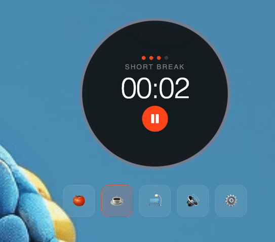
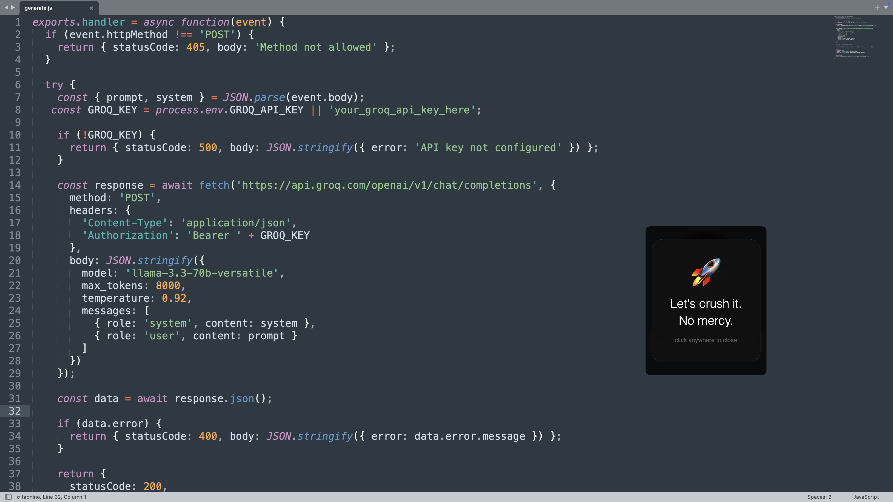
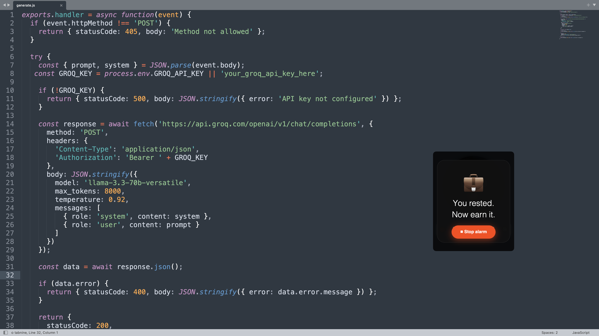

# 🍅 Pomodoro Focus
## ⬇️ Download

[](https://github.com/crisgea71/pomodoro-timer/releases/latest/download/Pomodoro.Focus-1.0.0-arm64.dmg)

> A Pomodoro timer that lives in your menu bar, screams at you when time's up, and roasts you with AI-generated messages every session.


---

## What it does

- 🔴 Sits in your **menu bar** — one click to show/hide
- ⏱ Always-visible **circle timer** on top of everything
- 🔊 **Alarm that loops** until YOU stop it — no ignoring it
- 🤖 **AI-generated funny messages** every session — never the same twice
- ⚙️ Set your own focus / break times
- 🎵 6 different alarm sounds to choose from

---

## Demo





---

## Tech Stack

- **Electron** — desktop app framework
- **Groq API + Llama 3.1** — AI message generation
- **Railway** — backend server (keeps API key secure)
- **Web Audio API** — alarm sounds generated in-browser

---

## How it works

```
User clicks play
      ↓
Timer counts down
      ↓
Time's up → alarm loops + AI message appears
      ↓
User clicks stop → alarm stops
      ↓
Next session starts
```

The AI messages are generated server-side on Railway — the API key is never exposed to the user.

---

## Run locally

```bash
git clone https://github.com/crisgea71/pomodoro-app.git
cd pomodoro-app
npm install
npm start
```

---

## Build .dmg

```bash
npm run dist
```

---

## Architecture

```
pomodoro-app/        ← Electron desktop app
pomodoro-server/     ← Node.js backend on Railway
```

---

## License

MIT
