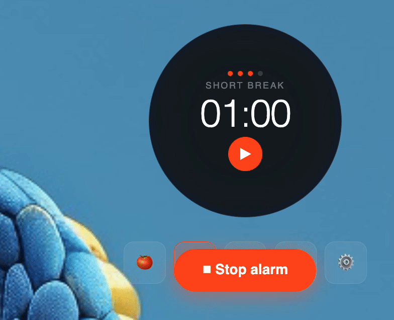

# 🍅 Pomodoro Focus

> A Pomodoro timer that lives in your menu bar, screams at you when time's up, and roasts you with AI-generated messages every session.

---

## ⬇️ Install (no Terminal needed)

1. Click the **Download** button above
2. Open the downloaded `.dmg` file
3. Drag **Pomodoro Focus** into your Applications folder
4. Open it from Applications
5. If macOS shows a security warning → go to **System Settings → Privacy & Security → Open Anyway**
6. Click the 🍅 icon in your menu bar to show/hide the timer

---

## What it does

- 🔴 Sits in your **menu bar** — one click to show/hide
- ⏱ Always-visible **circle timer** on top of everything
- 🔊 **Alarm that loops** until YOU stop it — no ignoring it
- 🤖 **AI-generated funny messages** every session — never the same twice
- ⚙️ Set your own focus / break times
- 🎵 6 different alarm sounds to choose from

---

## How to use

- 🍅 Focus mode (25 min default)
- ☕ Short break
- 🛋️ Long break
- 🔊 Choose alarm sound
- ⚙️ Settings — adjust minutes

---

## For developers

git clone https://github.com/crisgea71/pomodoro-timer
cd pomodoro-timer
npm install
npm start

---

## License

MIT
